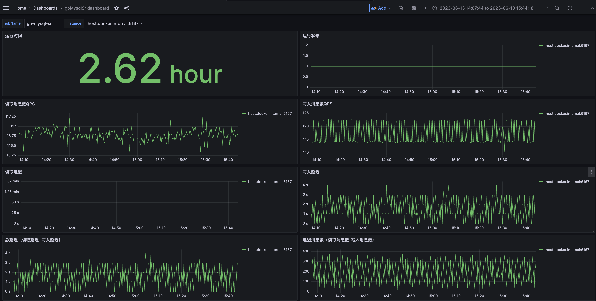

## mysql 同步到 starrocks


[](https://github.com/liuxinwang/go-mysql-starrocks/releases)


### 使用说明
#### 环境准备
```
1. GO构建版本 v1.18.10
2. MySQL 需要开启gtid
```
#### 1. 创建同步账号
```sql
mysql> CREATE USER 'go_mysql_sr'@'%' IDENTIFIED BY 'XXXXXX';
mysql> GRANT ALL ON _go_mysql_sr.* TO 'go_mysql_sr'@'%';
mysql> GRANT SELECT, REPLICATION CLIENT, REPLICATION SLAVE ON *.* TO 'go_mysql_sr'@'%';
```
#### 2. 修改配置文件
mysql-to-starrocks.toml
```toml
# name 必填，多实例运行时需保证全局唯一
name = "mysql2starrocks"

[input]
type = "mysql"
# 指定初次监听开始的gtid点位，当_xxx-pos.info点位文件内容存在时，此选项不生效
# start-gtid = "3ba13781-44eb-2157-88a5-0dc879ec2221:1-123456"

[input.config.source] # mysql连接信息
host = "127.0.0.1"
port = 3306
username = "go_mysql_sr"
password = ""

[sync-param]
# 同步chan队列最大值，达到会进行flush，最小100
channel-size = 10240
# 同步延迟秒数，达到会进行flush，最小1
flush-delay-second = 10

#[[filter]]
#type = "delete-dml-column" # 过滤列
#[filter.config]
#match-schema = "mysql_test"
#match-table = "tb1"
#columns = ["phone"]

#[[filter]]
#type = "convert-dml-column" # 转换dml行字段类型为json，column varchar（mysql） -> column json（starrocks）
#[filter.config]
#match-schema = "mysql_test"
#match-table = "tb1"
#columns = ["varchar_json_column", "varchar_arrayjson_column"]
#cast-as = ["json", "arrayJson"] # json示例: {"id": 1, "name": 'zhangsan'}, arrayJson示例: [{"id": 1, "name": 'zhangsan'}, {"id": 1, "name": 'lisi'}]

#[[filter]]
#type = "rename-dml-column"
#[filter.config]
#match-schema = "mysql_test"
#match-table = "tb1"
#columns = ["col_1", "col_2"]
#rename-as = ["col_11", "col_22"]

[output]
type = "starrocks" # or doris

[output.config.target] # starrocks连接信息
host = "127.0.0.1"
port = 9030
load-port = 8040
username = "root"
password = ""

[[output.config.rule]] # 库表同步映射1
source-schema = "mysql_test"
source-table = "tb1"
target-schema = "starrocks_test"
target-table = "tb1"

[[output.config.rule]] # 库表同步映射2
source-schema = "mysql_test"
source-table = "tb2"
target-schema = "starrocks_test"
target-table = "tb2"
```

#### 3. 启动
```shell
[sr@ ~]$ ./go-mysql-sr-linux-xxxxxx -config mysql-to-starrocks.toml
```

#### 4. 查看日志
默认输出到控制台，指定log-file参数运行
```shell
[sr@ ~]$ ./go-mysql-sr-linux-xxxxxx -config mysql-to-starrocks.toml -log-file mysql2starrocks.log
[sr@ ~]$ tail -f mysql2starrocks.log
```

#### 5. 查看帮助
```shell
[sr@ ~]$ ./go-mysql-sr-linux-xxxxxx -h
```

#### 6. 后台运行
```shell
[sr@ ~]$ ./go-mysql-sr-linux-xxxxxx -config mysql-to-starrocks.toml -log-file mysql2starrocks.log -level info -daemon
```

#### 7. 监控
7.1 集成prometheus，开放6166端口，通过metrics暴露指标
```shell
[sr@ ~]$ curl localhost:6166/metrics
# 参数说明
# 读取源端延迟（通过event data timestamp与当前时间差值计算获得）
go_mysql_sr_read_delay_time_seconds 0
# 读取源端消息数（累加）
go_mysql_sr_read_processed_ops_total 6930
# go-mysql-sr启动时间，用于计算运行时长
go_mysql_sr_start_time 1.68664498e+09
# 写入目的端延迟（根据写入的event data timestamp与当前时间差值计算获得，3s计算一次）
go_mysql_sr_write_delay_time_seconds 1
# 写入目的端消息数（累加）
go_mysql_sr_write_processed_ops_total 6924
```
7.2 prometheus配置参考
```shell
scrape_configs:
  # 新增go-mysql-sr的job_name
  - job_name: "go-mysql-sr"
    static_configs:
      - targets: ["host.docker.internal:6166", "host.docker.internal:6167"]
```
7.3 grafana dashboard 监控，json file下载 [grafana-goMysqlSr-dashboard.json](configs/grafana-goMysqlSr-dashboard.json)


#### 8. API
8.1 新增同步表
```shell
curl localhost:6166/api/addRule -d '{"source-schema": "mysql_test","source-table": "tb3", "target-schema": "starrocks_test", "target-table": "tb3"}'
```
*result: add rule handle successfully.*


8.2 删除同步表
```shell
curl localhost:6166/api/delRule -d '{"source-schema": "mysql_test","source-table": "tb3"}'
```
*result: delete rule handle successfully.*

8.3 查询同步表
```shell
curl -s localhost:6166/api/getRule | python -m json.tool
```
*result:*
```json
{
    "mysql_test:tb1": {
        "source-schema": "mysql_test",
        "source-table": "tb1",
        "target-schema": "starrocks_test",
        "target-table": "tb1",
        "RuleType": "init",
        "Deleted": false
    },
    "mysql_test:tb2": {
        "source-schema": "mysql_test",
        "source-table": "tb2",
        "target-schema": "starrocks_test",
        "target-table": "tb2",
        "RuleType": "init",
        "Deleted": false
    },
    "mysql_test:tb3": {
        "source-schema": "mysql_test",
        "source-table": "tb3",
        "target-schema": "starrocks_test",
        "target-table": "tb3",
        "RuleType": "dynamic add",
        "Deleted": false
    }
}
```
*注意：通过api修改不会持久化到配置文件。*

-----------

#### [使用docker部署go-mysql-sr](docs/docker%20run.md)

-----------

#### 同时也支持mongo，详情参考[mongo sync配置](docs/mongo%20sync.md)